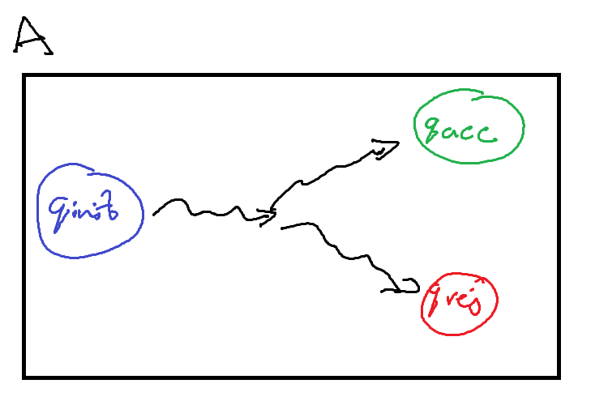
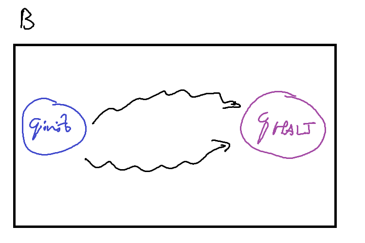
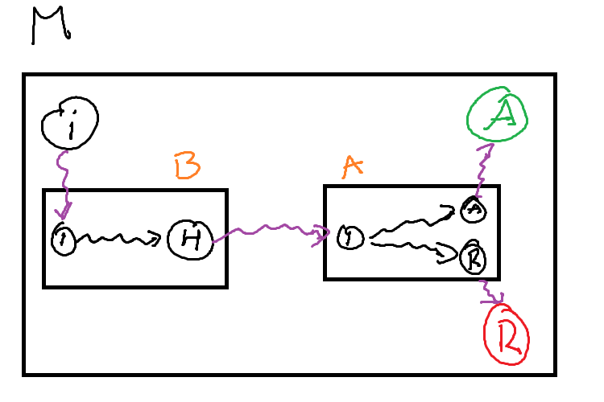
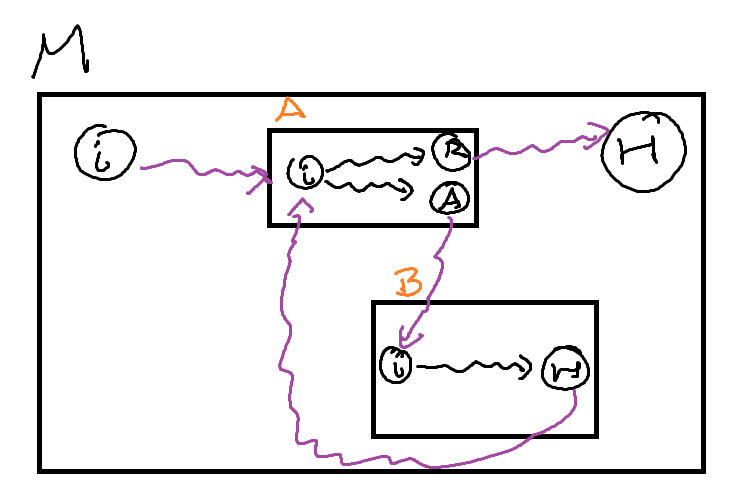

# Turing Machines II

Wordcount: {{wordcount}}

## Turing Machines and Abstraction

Writing a Turing Machine can be a very complicated procedure.
While it is technically possible to write a Turing Machine to solve something such as $\text{IS\_PRIME}(n)$, the actual machine may be very large, and difficult to write manually.
To solve this problem, we rely on abstract descriptions of our Turing Machines with the understanding that if it was absolutely necessary we could turn it into the actual TM.

To help us with this abstraction, we can build up a few common primitives used in most algorithm descriptions and show how they may be converted into a Turing Machine.

### Variables

A variable $x$ is an area of memory that can hold values.
In a computer, these variables are of a fixed size - 32 or 64 bits.
For a Turing Machine, we will state that variables are of an initial size, but can grow in size as they need to.
This is similar to how a C++ std::vector handles it's memory, but instead of having elements of an array, we have a list of cells.
If we run out of space, we can extend the variable by moving any other work on the tape.

A variable $x$ in a Turing Machine is the string $\langle x \rangle$ on our tape between the symbol's $x$ and $\square$.
We use $x$ as a symbol on our tape to indicate that this region of memory is for the variable $x$.
You can come up with some other variable labelling scheme to make it more flexible, but this works if our machine only needs a fixed number of variables.

To modify our variable we need to perform the following:

1. Move to the variable on the tape
2. Update the variable as needed
3. If the new value requires more space then allocated
    - Move _every_ symbol to the right of variable over by twice the current length of $\langle x \rangle$
    - Move the end of variable marker to the new position
    - Update the variable as needed.

### Functions / Subroutines

In our variable allocation, we required a series of subroutines to update the value:

- Move all the symbols over by $k$ cells
- Updating the variable - adding $z$ to an integer, writing a new value in the cells etc.

How can we actually perform this on our Turing Machine?

First, we can write these 'subroutines' as other Turing Machines that just perform the task we need.
In the below figures, these machines are drawn abstractly: the squiggly arrows refer to some intermediatry states and transitions that occur between the initial and halting states.

To call these machines as a subroutine, our primary machine $M$ must provide some transition into the initial state of the subroutine machine $A$ / $B$, and then provide transitions out from $A$'s ($B$'s) halting state.
The machines may need some additional logic to connect them up such as moving into the correct position or cleaning up any left over computation on the tape, but these are relatively simple 'bridging' programs.

We can use these subroutines to build large and complex Turing Machines out of a relatively small 'standard library' of other machines.

### Loops

We can implement a loop in much the same way.
The most common form of a `while` loop requires two components:

1. A condition to test for completion
2. A body to execute if it is the condition is true 

If we treat each of these components as a subroutine, we can implement a `while` loop.
We can use a Decision Turing Machine as our condition 

- If it accepts, our condition is true and we execute the body of the loop
- If it rejects, our condition is false and we continue into the rest of the machine

The body is some other computational turing machine, that when it is finished (the subroutine machine halts), we start testing the condition of the loop.

## TM Variants

### Different kinds of Tapes

When we defined a Turing Machine, we described the tape as infinite in length.
The reason for this was to clarify that any algorithm would have as much space as it possibly needs.
We never have to worry about running out of memory.

The standard description of a Turing Machine is that we can infinitely in either direction.
This is akin to the integers on a number line.

$$ \mathbb{Z} = (-\infty, \infty) $$

However, we know that there are other kinds of infinite such as the naturals.

$$ \mathbb{N} = [0, \infty) $$

So it stands that we can construct different kinds of infinite tapes for a Turing Machine.
The first kind is what we have used before and the normal definition: A tape that is infinite in two directions - bidirectional.
The second kind is a tape that is infinite in only one directin - unidirectional.

A Turing Machine with a bidirectional tape is called a **two-way infinite tape** Turing Machine, or a Two-Way TM

\<insert diagram of two way tape turing machine\>

A Turing Machine with a unidirectional tape is called a **one-way infinite tape** Turing Machine, or a One-Way TM.

\<insert diagram of one way tape turing machine\>

:::{.callout-tip}
Be careful when discussing a unidirectional tape.
It does _not_ mean that our tape head can only move in a single direction, but that there is some leftmost cell that the tapehead cannot move past.
:::

The One-Way TM works by adding a new symbol, $\triangleright$, to its tape alphabet to mark that we are at the end of the tape.
This new symbol $\triangleright$ is placed on the leftmost cell of our tape.
We then add the following instruction to _every_ state:

$$ \forall q \in Q \; q, \triangleright \rightarrow q, \triangleright, R $$ 

For clarity, when we write an input string $x$ on our tape, we place it after the end-of-tape marker.
This means that the initial configuration of a one-way tape Turing Machine is
$$ c_0 = \triangleright q_\text{init} x $$

What this means is that our TM will 'bounce' off the end-of-tape marker whenever it reaches the leftmost cell.
It will never be able to move beyond that cell.

:::{.callout-note}
## The direction of a One-Way TM

Something to note is that english readers might place the end-of-tape marker $\triangleright$ on the left most cell as we read from left to right.
There is no explicit reason for this beyond preference, so it is entirely possible to make use of a different symbol $\triangleleft$ that is on the rightmost cell instead.

$$ \forall q \in Q \; q, \triangleleft \rightarrow q, \triangleleft, L $$

This would mean that the Turing Machine has a unidirectional tape to the left instead of the right.

Later we will see how this convention can be used.
:::

:::{.callout-note}
## Bounded Tapes

A special kind of Turing Machine called a **Linear Bounded Turing Machine** has a finite tape.
The exact definition is similar to a One-Way TM, but with both a left and right end-of-tape marker.
:::

We have constructed two different types of Turing Machine.
Can they do the same things?

:::{.callout-warning}
## Question

What does it mean for two Turing Machines to do the same thing?
Previously we have seen a definition for equivalent Turing Machines:
$$ \forall x \in \Gamma^\ast, M(x) = N(x) $$

Is this definition sufficient to show that different kinds of Turing Machines are equivalent?
:::

To show that these two types of Turing Machine are equivalent, we can describe the process by which we can convert a Two-Way TM into a One-Way TM and vice versa.

**Show that any One-Way TM can be converted into a Two-Way TM**

**Proof sketch**: 
_
We want to recreate the behaviour of a two-way machine on a one-way machine.
To accomplish this, if our tape head on the two-way machine needs to move left, and no more space is available, we need to provide that needed space.
If we shift every accessed cell over by one, we have 'appended' a new blank symbol to the right, and our machine can continue moving left.
_

Let $M$ be a two-way TM, define a one-way TM $M^\prime$ as follows:

1. If the head is not at the leftmost cell, execute the transition as usual.
2. If the transition would move the head to the leftmost cell (Scanning $\triangleright$), then
	1. Move every cell used so far on the tape, one cell to the right
	2. Set the leftmost cell before end-of-tape to blank
	
**Show that any Two-Way TM can be converted into a One-Way TM**

**Proof sketch**: 
_
	A one-way TM starts in the initial configuration of $\triangleright q_\text{init} x$.
	So when our two-way TM starts, we can recreate the one-way behaviour by manually adding an end-of-tape marker to the left of the input tape.
	Then, for all states we can add the instruction to bounce off the end-of-tape marker.
	Essentially, we are saying that even though there is infinite memory in the left direction, we will not make use of it.
_

Let $M$ be a one-way TM, define a two-way TM $M^\prime$ as follows:
	
Let $Q^\prime = Q \cup \{ q^\prime_\text{init} \}$ where $q^\prime_\text{init}$ is the initial state of $M^\prime$.
Add the following instruction to every state $q \in Q$ execpt $q^\prime_\text{init}$:
$$ q, \triangleright \rightarrow q, \triangleright, R $$ 

Define the following instruction for $q^\prime_\text{init}$:
\begin{align*}
	& \forall s \in \Delta, \; q^\prime_\text{init}, s \rightarrow q^\prime_\text{init}, s, L \\
	& q^\prime_\text{init}, \sqcup \rightarrow q_\text{init}, \triangleright, R
\end{align*}

:::{.callout-warning}
## Question: Comparing running times
For both of the above proofs, what is the running time of $M^\prime$ compared to $M$?

**The time function of the two-way TM $M^\prime$ compared to the one-way TM $M$**

Let $t(n)$ be the time function of the one-way TM $M$
Our new machine $M^\prime$ leaves the machine mostly the same but right at the beginning it does two things:
1. Immediatly moves left one cell
2. Writes $\triangleright$ and moves right

and then continues the computation as $M$ would.

So $M^\prime$ executes only two more instructions then $M$, so $$ t^\prime(n) = t(n) + 2 = O(t(n)) $$

**The time function of the one-way TM $M^\prime$ compared to the two-way TM $M$**

Let $t(n)$ be the time function of the two-way TM $M$

The new machine $M^\prime$ leaves $M$ mostly unchanged except that any time it moves left onto the end-of-tape marker, it shifts every cell over once to the right.

The worst case scenario is when $M$ always moves left, so for every step $M^\prime$ takes, it must execute the subroutine of shifting the cells over.
We need to shift the cells over $t(n)$ times.
This shift operation is linear so the runtime of a single shift is the total number of cells accessed so far, or the space function $s(n)$.
$s(n)$ is bounded above by $t(n)$ so in the worst case, the shift operation is $O(t(n))$

Therefore, $$ t^\prime(n) = t(n) \cdot O(t(n)) = O(t^2(n)) $$
:::

### Extended Instruction Sets

An important part of the original pitch for a Turing Machine as a mathematical model of computation was that it was simple.
One of the componets of this simplicity is in the definition of an instruction.

$$ q, s, \rightarrow q', s', \{L, R\} $$

Our tape head can only ever move left or right a single cell.
The instruction does not provide a way to stay in place, nor to skip multiple cells at a time.

However, if we ignore the simplicity requirement, we can add additional movement to the tape head.

A Turing Machine with a stationary movement is called a **stationary** Turing Machine, and has instructions of the form
$$ q, s, \rightarrow q', s', \{L, S, R\} $$

What this looks like as configuration with the instruction $q_i, v_1 \rightarrow q_j, v_1', S$,
$$ w \: q_i \: v_1 v_2 ... v_n \vdash w \: q_j \: v_1' v_2 ... v_n $$ 

Does this stationary movement make it solve any additional problems that the standard Turing Machine cannot?
No, as we can recreate that stationary movement in a standard Turing Machine by moving left and then right over two configurations.

\begin{align}
	& q_i, s, \rightarrow q_j, s', S \text{ becomes } \\ 
	& q_i, s \rightarrow q_i', s', R \text{ and } \forall \sigma \in \Delta, q_i', \sigma \rightarrow q_j, \sigma, L
\end{align}

$$ w \: q_i \: v_1 v_2 ... v_n \vdash w v_1' \: q_i' \: v_2 ... v_n \vdash w \: q_j \: v_1' v_2 ... v_n $$ 

\<diagram of stationary instruction being modified into standard instruction\>

We can do the exact same thing for a movement that steps twice in one instruction.

A Turing Machine with a two-step movement is called a **two-step** Turing Machine, and has instructions of the form
$$ q, s, \rightarrow q', s', \{LL, L, R, RR\} $$

As a configurations following the instruction $q_i, v_1 \rightarrow q_j, v_1', RR$,
$$ w \: q_i \: v_1 v_2 v_3 ... v_n \vdash w  v_1' v_2 \: q_j \: v_3 ... v_n $$ 

We can use the same idea from stationary machines for simulating two step movement on a standard Turing Machine

\begin{align}
	& q_i, s, \rightarrow q_j, s', RR \text{ becomes } \\ 
	& q_i, s \rightarrow q_i', s', R \text{ and } \forall \sigma \in \Delta, q_i', \sigma \rightarrow q_j, \sigma, L
	\\\\
	& q_i, s, \rightarrow q_j, s', LL \text{ becomes } \\ 
	& q_i, s \rightarrow q_i', s', L \text{ and } \forall \sigma \in \Delta, q_i', \sigma \rightarrow q_j, \sigma, L
\end{align}

The instruction $q_i, v_1 \rightarrow q_j, v_1', RR$, is now executed as
$$ w \: q_i \: v_1 v_2 v_3 ... v_n \vdash w  v'_1 \: q'_i \: v_2 v_3 ... v_n \vdash w  v'_1 v_2 \: q_j \: v_3 ... v_n $$ 

\<diagram of two step instruction being modified into standard instruction\>

There is no particular reason to limit ourselves to just two steps.
We can define a **$k$-step** Turing Machine, which has instructions of the form
$$ q, s, \rightarrow q', s', \{ L^k \mid k > 0 \} \cup \{ R^k \mid k > 0 \} $$

A **multi-step** Turing Machine is the umbrella term for a $k$-step Turing Machine with $k > 1$.

:::{.callout-tip}
## Proof practice
Try prove that a $k$-step Turing Machine is equivalent to a standard Turing Machine by induction.

We have seen the base case that $k = 2$ is can be simulated by a standard ($k = 1$) Turing Machine.
So now all you need to prove is that a $k + 1$-step TM can be simulated by a $k$-step TM.
:::

:::{.callout-warning}
## Question

We've seen above that simulating the stationary and two-step instructions require additional instructions, and thus configurations, in a standard TM.

Identify the time functions of both the multi-step and stationary machines, as well as the standard machines that recreate the behaviour. 
What advantages are provided by the additional instructions?
:::

### Multi-tape Turing Machines

All of our previous machines have only ever had a single tape. 
Truthfully, this is because of the same pursuit for simplicity as our simple instructions.

\< diagram of 2-tape turing machine \>

A $k$-tape Turing Machine has $k$ infinte tapes, where each tape has its own head to read and write symbols as well as move.

Our instructions for $k$-tape Turing Machines change to be a conditional statement based off the symbols on _every_ tape currently being scanned.
Additionally they need to specify what we write on _every_ tape, and the direction to move the head on _every_ tape.

$$ q, \begin{pmatrix} s_1 \\ s_2 \\ ... \\ s_k \end{pmatrix} \rightarrow q', \begin{pmatrix} s_1' \\ s_2' \\ ... \\ s_k' \end{pmatrix}, \begin{pmatrix} D_1 \\ D_2 \\ ... \\ D_k \end{pmatrix} = q, \vec{s} \rightarrow q', \vec{s'}, \vec{D} $$

Multi-tape Turing Machines are convenient as they allow for information to be shared across tapes, and make it faster to access that information. 
However, they are significantly more complex to write.

In a standard Turing Machine, there needs to be $|\delta| = (|Q| - 2) \times |\Delta|$ instructions.
A $k$-tape Turing Machine has $|\delta| = (|Q| - 2) \times |\Delta|^k$ instructions. 
We need an instruction for every combination of symbols being read across all the tapes.

Do these multi-tape Turing Machines provide any additional capability over a standard Turing Machine?
Again, no.
We can simulate a $k$-tape Turing Machine on a standard TM by segmenting the single tape into $k$ segments.
We can distinguish between tapes by end-of-tape markers $\triangleright$ and $\triangleleft$, and now we can rely on the same logic as our One-Way and Two-Way TM's to simulate the infinite space of these tapes.

\< diagram of two tapes on a single tape \>

The last thing we need to consider is how do we update the tape head positions and symbols on the different tapes.
For every one instruction in the $k$-tape TM, we need to move to each tape segment and update it accordingly.

On each tape, we can record the head position by a special symbol: If the head is currently scanning a cell with symbol $s$, we write $\dot{s}$.

To process an instruction, 

1. Move to the first tape
2. For each tape
	1. We scan for the $\dot{s}$ symbol on the current tape
	2. Update it to the new symbol
	3. Remove the dot 
	4. Move to the next head position, 
	5. Update the new head position symbol $s$ to $\dot{s}$
	6. Move on to the next tape

## Turing Machines as Data

## Universality
